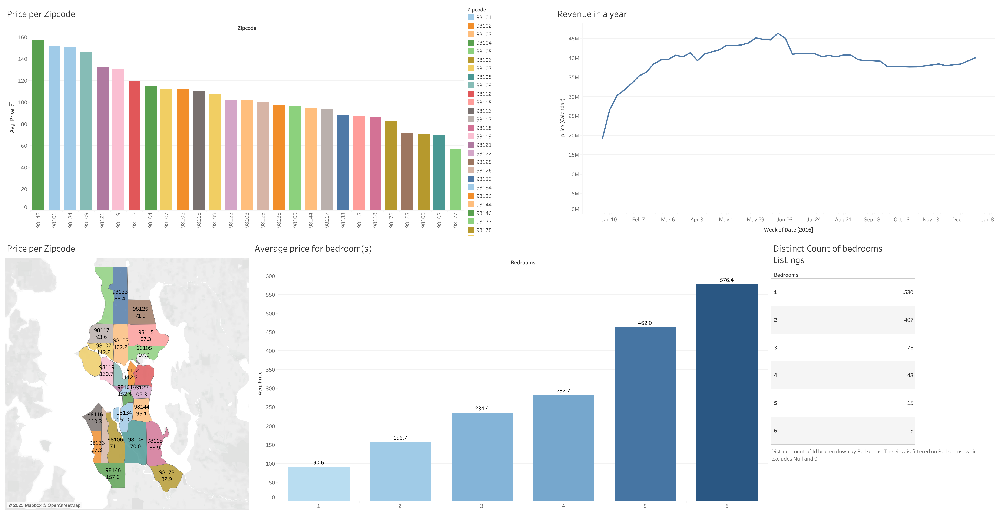

# Tableau_projects

### **1. Airbnb Seattle Market Analysis**

**Overview:**
This project analyzes Airbnb rental prices, revenue trends, and listing distributions in Seattle. It provides insights into pricing across different zip codes, seasonal revenue trends, and the relationship between the number of bedrooms and rental costs.

---

### More Tableau projects coming soon!

